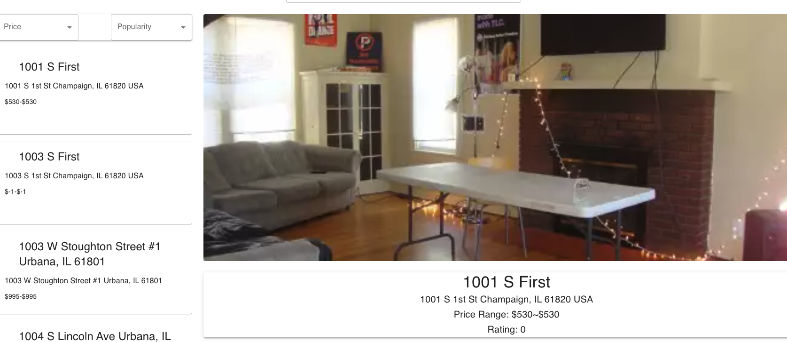
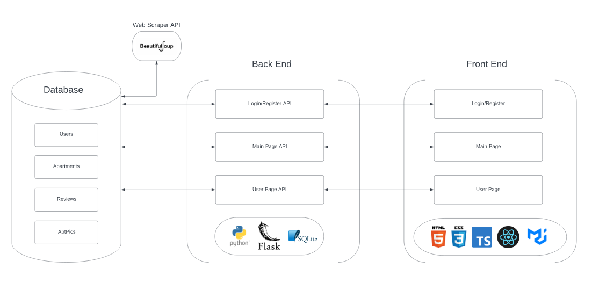

<a name="readme-top"></a>
# Move Securely

<!-- [![Contributors][contributors-shield]][contributors-url]
[![Forks][forks-shield]][forks-url] -->
[![Stargazers][stars-shield]][stars-url]


<details>
  <summary>Table of Contents</summary>
  <ol>
    <li>
      <a href="#about-the-project">About The Project</a>
      <ul>
        <li><a href="#introduction">Introduction</a></li>
      </ul>
    </li>
    <li>
      <a href="#technical-architecture">Technical Architecture</a>
      <ul>
        <li><a href="#components">Components</a></li>
        <li><a href="#diagram">Diagram</a></li>
      </ul>
    </li>
    <li><a href="#installation-and-usage">Installation and Usage</a></li>
    <li><a href="#group-members-and-their-roles">Group members and their roles</a></li>
    <li><a href="#license">License</a></li>
    <li><a href="#acknowledgements">Acknowledgements</a></li>
  </ol>
</details>

## About the Project



Students have limited knowledge about living in a new city. They can find mixed information on Facebook groups, Reddit, online group chats, and discussions with others. By centralizing ratings and information about specific dorms and apartments, our application makes decisions more straightforward and the process of moving to a new city smoother.

### Introduction

Our project is an apartment and dorm rating website application. The current database provides data for over 200 residences, allowing users to review, comment, and rate them.

Anyone using the website can access the main page, scroll through the information smoothly, and view the residences they choose. Logged-in users can access exclusive parts of the website, like reviewing and commenting. Users can also view their liked apartments on their user page.

Our website differs from many residence finders through the interaction it allows. By combining the tool of finding residences in your area with social interaction, we create a valuable and helpful application.

## Technical Architecture

[![React][React.js]][React-url] [![TypeScript][TypeScript]][TypeScript-url] [![Flask][Flask]][Flask-url] [![SQLite][SQLite]][SQLite-url]

Our project has a React with TypeScript frontend, Flask backend as the web framework, and SQLite as the database.

React works alongside TypeScript in our application. React posts form data to Flask, handles client-side navigation, and styles the website. Within React, we used the MUI component library to make our design easier to implement and to save time for more complicated tasks. We also used the prettier code formatter to standardize the code.

Flask processes the data sent from React, writes to the database, and handles user login, registration, and sessions. Depending on the request, it sorts based on price or rating and modifies the user's data. Some Flask libraries were Flask-Login and Flask-Session. We used Pylint and PyTest on our code.

The SQLite database has tables for Users, Apartments, AptPics, and Reviews.

## Components
### Login and Register Pages

The login and register pages are the starting points for users who want access to every part of the website. It interacts with other components by linking to other pages if the user inputs accurate information, which the backend checks. The backend uses Authlib and Flask-Session. 

Samuel and Minh worked on both the front end and backend and Aden contributed to the backend.
### Main Page

The main page shows a scrollable list of residence information, a search bar, and specific residence data, enabling reviewing and rating. It interacts with other components via a button to the user page and a login/logout button; the backend uses Flask requests and sorts the apartments' prices and ratings if the user chooses. The residence data comes from a web scraper from online sources, and our code writes it to the database.

Aden worked on the left section and search bar, Feng worked on the right section and web scraper, and Minh did the backend.
### User Page

This page is restricted to logged-in users, who can view their liked apartments and update their user data like email and password. It interacts with other components via a button to the main page and a logout button.

Minh worked on the front end, Samuel worked on the backend, and Aden did the user page's API in the backend.
### Diagram



  

## Installation and Usage

<!-- If project does not get deployed, delete the line below -->

The project is deployed to production and available on the web at [movesecurely.com](https://movesecurely.com).

If you would like to access the project code or the development website, follow these steps:

1. Clone the repo:
   ```sh
   git clone https://github.com/CS222-UIUC/course-project-group-5.git
   ```

2. In the `src/frontend` directory, install npm packages:
   ```sh
   npm install
   ```
3. In the same directory start the React app:
    ```sh
    npm start
    ```
4. Open another terminal and move to the `src/backend` directory. Start the Flask app:
    ```sh
    flask run
    ```
5. In your browser, go to [http://localhost:3000](http://localhost:3000).

## Group members and their roles

[Minh Phan](https://github.com/MinhPhan8803) created the backend for the main page, which sorts residences based on prices and ratings, writes reviews to the database, and deletes reviews. Minh did all the frontend work on the user page and website navigation and did the most CSS out of everyone.

[Samuel Du](https://github.com/sd-20) created the login and register pages' front end and contributed to the user page backend. In the user page backend, he updated the user's data and compiled the user's liked residences. Also, he contributed to our GitHub CI/CD pipeline for verifying test coverage and linting our code.

[Zongxian Feng](https://github.com/xxxfzxxx) created the residence scraper to populate our database and completed the right section of the main page, where users can view individual residence data, review, comment, and rate them. He also contributed to the CI/CD pipeline.

[Aden Krakman](https://github.com/akrakman) created the search bar and the left section of the main page, where anyone can see the residence data in a scrollable list. He contributed to the user page backend, where users update their data. Also, he implemented the user page API, which maintains a session and posts user data to the frontend user page.

Everyone tested their code and contributed to the overall design and implementation of the project.

## License
Distributed under the MIT License. See `LICENSE.txt` for more information.

## Acknowledgements
Thank you to our team mentor Nikhil.

<p align="right">(<a href="#readme-top">back to top</a>)</p>

<!-- MARKDOWN LINKS & IMAGES -->
<!-- https://www.markdownguide.org/basic-syntax/#reference-style-links -->
[contributors-shield]: https://img.shields.io/github/contributors/CS222-UIUC/course-project-group-5.svg?style=for-the-badge
[contributors-url]: https://github.com/CS222-UIUC/course-project-group-5/graphs/contributors
[forks-shield]: https://img.shields.io/github/forks/CS222-UIUC/course-project-group-5.svg?style=for-the-badge
[forks-url]: https://github.com/CS222-UIUC/course-project-group-5/network/members
[stars-shield]: https://img.shields.io/github/stars/CS222-UIUC/course-project-group-5.svg?style=for-the-badge
[stars-url]: https://github.com/CS222-UIUC/course-project-group-5/stargazers
[React.js]: https://img.shields.io/badge/React-20232A?style=for-the-badge&logo=react&logoColor=61DAFB
[React-url]: https://reactjs.org/
[Flask]: https://img.shields.io/badge/flask-%23000.svg?style=for-the-badge&logo=flask&logoColor=white
[Flask-url]:https://flask.palletsprojects.com/en/2.2.x/
[SQLite]: https://img.shields.io/badge/sqlite-%2307405e.svg?style=for-the-badge&logo=sqlite&logoColor=white
[SQlite-url]: https://www.sqlite.org/index.html
[TypeScript]: https://img.shields.io/badge/typescript-%23007ACC.svg?style=for-the-badge&logo=typescript&logoColor=white
[TypeScript-url]: https://www.typescriptlang.org/
